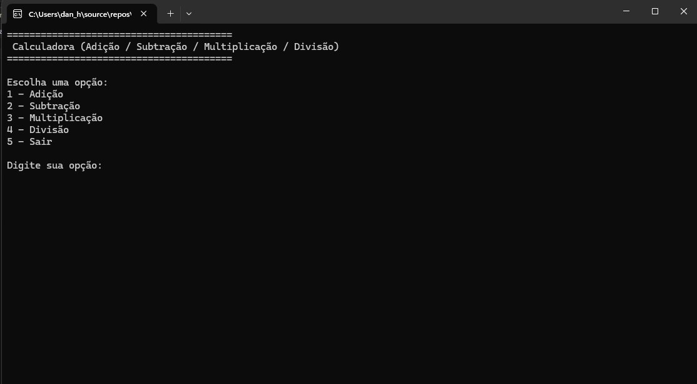
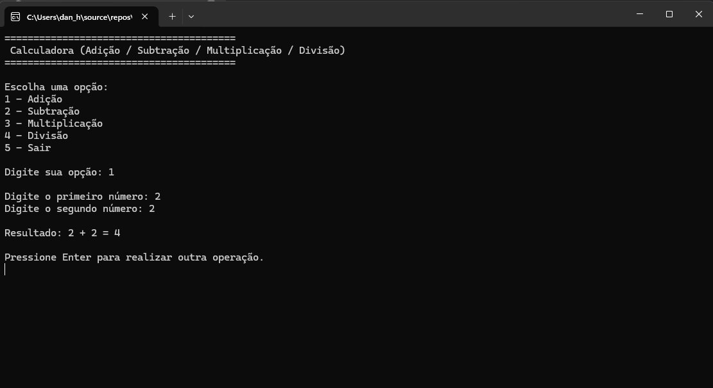
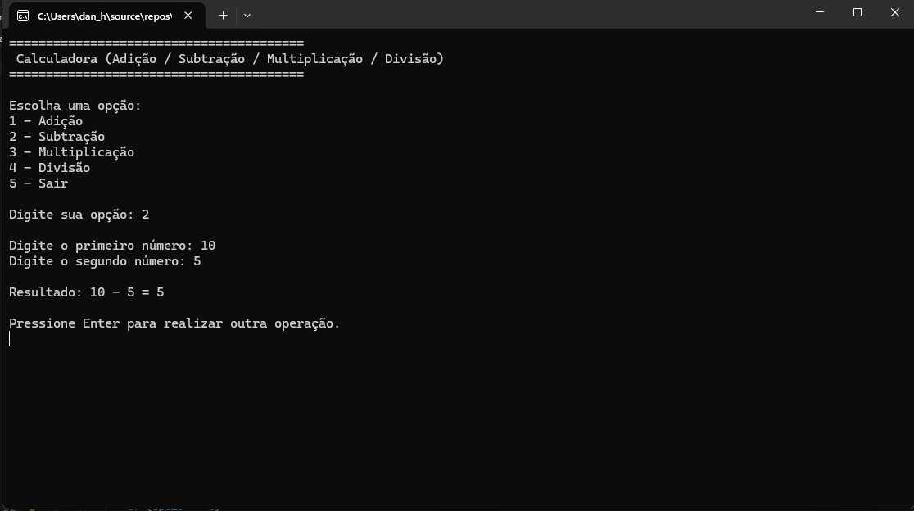
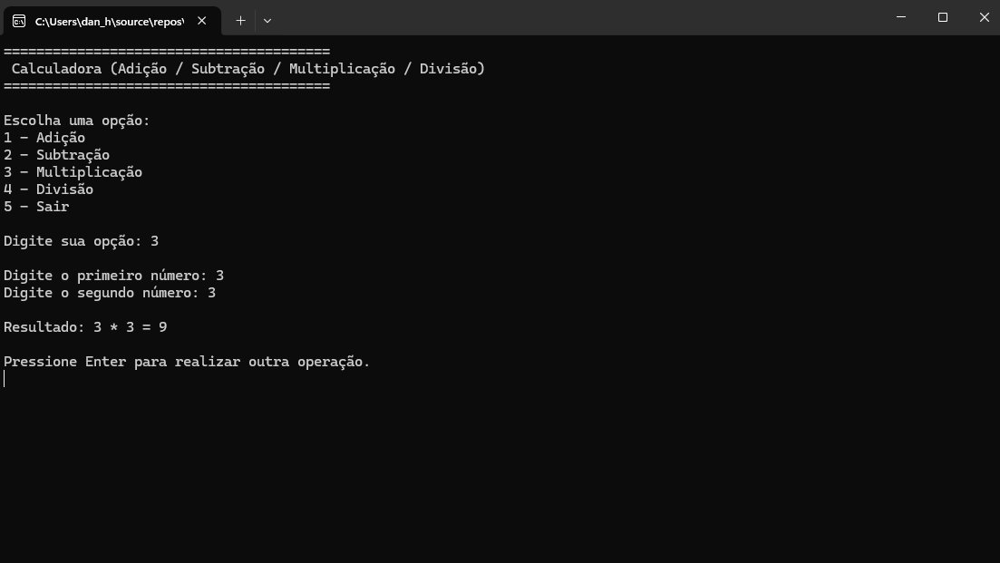
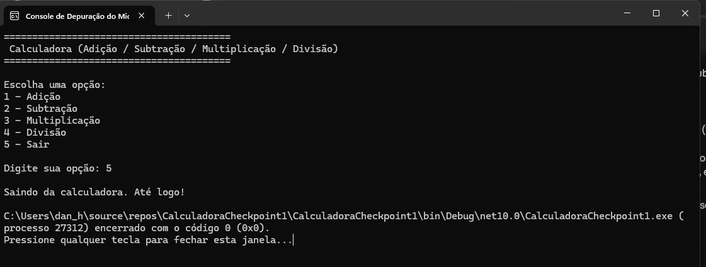

# 🧮 Calculadora - Checkpoint 1

Aplicação console desenvolvida em **C#** como parte do Checkpoint 1 da disciplina.  
O programa realiza operações básicas de **Adição, Subtração, Multiplicação e Divisão**, com tratamento de erros e loop de execução contínua.

---

## 👥 Integrantes

| Nome |
|------|
| Danilo Wendler |
| Pedro Muzel |

---

## 🛠️ Tecnologias Utilizadas

- C# (.NET)
- Aplicação Console

---

## ⚙️ Funcionalidades

- ✅ Menu interativo com 5 opções
- ✅ Adição, Subtração, Multiplicação e Divisão
- ✅ Tratamento de divisão por zero
- ✅ Validação de entradas inválidas
- ✅ Execução contínua até o usuário escolher sair

---

## 📸 Telas do Sistema

### Menu Principal

---

### Teste 1 — Adição

> Opção `1` | Entrada: `2 + 2` | Resultado: `4`

---

### Teste 2 — Subtração

> Opção `2` | Entrada: `10 - 5` | Resultado: `5`

---

### Teste 3 — Multiplicação

> Opção `3` | Entrada: `3 * 3` | Resultado: `9`

---

### Teste 4 — Divisão

> Opção `4` | Entrada: `10 / 5` | Resultado: `2`

---

### Encerrando o Programa

> Opção `5` — Sair

## 📌 Critérios Atendidos

| Critério | Detalhe | Pontos |
|----------|---------|--------|
| Uso correto de if/else e switch/case | Switch para operações, if/else para validações | 4 pts |
| Tipos de dados corretos | `int`, `double`, `string` | 4 pts |
| Boas práticas — PascalCase | `Opcao`, `PrimeiroNumero`, `SegundoNumero`, `Resultado` | 2 pts |
| **Total** | | **10 pts** |
